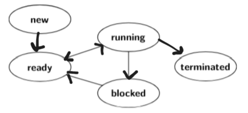

Transiciones
#### new -> ready
Se crea un proceso y luego se lo pone como listo para ejecutar

Componentes: PCB

#### ready -> running

Un proceso esta listo para ejecutarse (por que se lo acaba de crear o porque fue interrumpido por el scheduler) y ahora se lo pone como RUNNING porque es su turno de ejecutar.

Componentes: scheduler, proceso, PCB

#### running -> ready

El proceso estaba ejecutandose y se lo pone como READY porque fue interrumpido por el scheduler

Componentes: scheduler, proceso, PCB

#### running -> blocked

El proceso estaba corriendo y se lo pone como bloqueado porque intentó acceder a I/O

Componentes: proceso, PCB, I/O

#### blocked -> ready

El proceso termino la actividad por la cual estaba bloqueado y pasa a ready para que el scheduler lo pueda seleccionar

Componentes: PCB, proceso

#### running -> terminated

El proceso estaba ejecutandose y se termina solo o se le manda una señal para que se muera. 

Componentes: PCB, proceso, SO